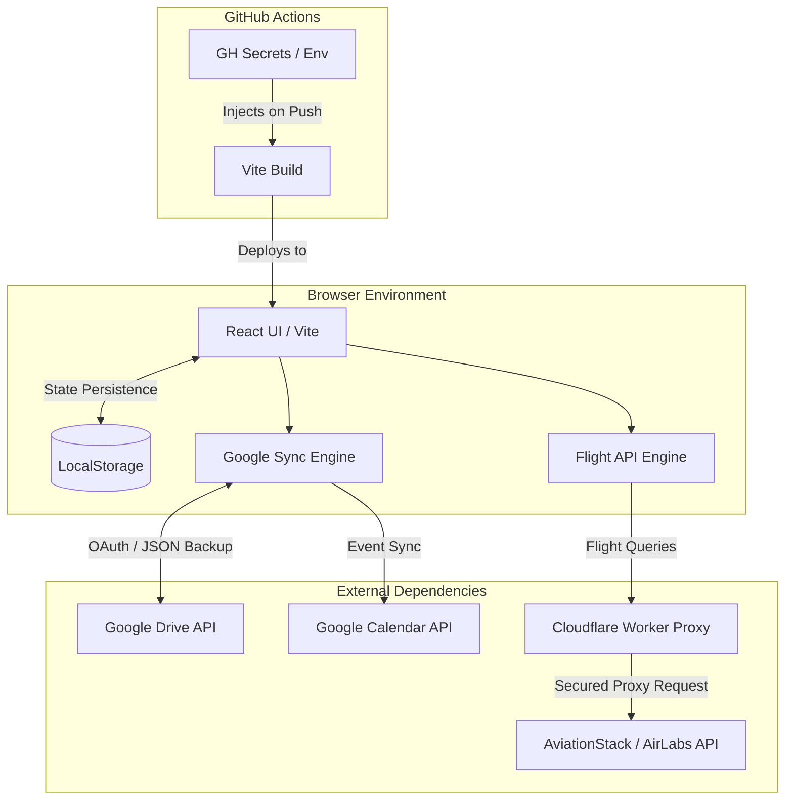

# Reverse Ticket Manager (RTM) - System Operations & Reliability Guide

本文件為 **航班反向票購買與行程防呆系統 (Reverse Ticket Manager)** 的 SRE (Site Reliability Engineering) 標準操作規範與系統架構文件。

本系統設計為 **100% Client-Side 靜態網頁應用程式 (SPA)**，專注於提供極致的離線可用性 (Offline-First)、自動化災難還原 (Disaster Recovery)，並針對外部依賴 (API) 提供穩健的備援機制 (Fallback & Resiliency)。

🔗 **[Production Environment (GitHub Pages)](https://imhahac.github.io/reverse-ticket-manager/)**

---

## 1. System Topology (系統架構圖)

為了消弭伺服器維運成本並保障使用者隱私，RTM 採用**邊緣與客戶端運算**架構。



---

## 2. Reliability & Resilience (可靠性與韌性設計)

在無後端服務的架構下，RTM 針對各類失效場景 (Failure Scenarios) 實作了防禦機制：

### 2.1 斷網與狀態持久化 (Offline-First)
- **機制**：所有的應用程式狀態 (機票、趟次邏輯、設定) 皆透過自定義的 `useLocalStorage` Hook 進行嚴格同步。
- **SLO 影響**：即便使用者在沒有網路的機艙內，依然可以進行 100% 的讀寫操作，確保核心可用性不受網路波動影響。

### 2.2 外部 API 降級策略 (Graceful Degradation)
- **單點故障防禦**：當 `AviationStack` 或 `AirLabs` 其中之一的航班服務失效或 Rate Limit 觸發時，系統的 UI 只會顯示「無法自動帶入」，但**不阻饒**使用者手動輸入航班時間的核心流程。
- **CORS 網路備援**：API 請求層內建了以延遲時間 (Timeout) 為基礎的 Multi-Proxy 演算法。當直連 API 被瀏覽器阻擋時，會自動 fallback 至 `corsproxy.io` 或 `allorigins.win` 備用路由。

---

## 3. Disaster Recovery (災難復原與備份)

系統可能面臨的最嚴重狀況為**客戶端快取清除**或**資料型態破壞 (Data Corruption)**。

### 3.1 備份策略 (Backup Strategy / RPO)
- **Google Drive 快照**：系統整合了 Drive API，使用者一鍵即可將當下的 `localStorage` 狀態打包成 `reverse-tickets.json` 同步至個人的 AppData 隱藏區塊。
- **本地 JSON 匯出**：針對無 Google 帳號的使用者，提供實體 JSON 檔案的匯入與匯出 (Cold Backup)。

### 3.2 災後重建 (System Recovery / RTO)
- **全局 Error Boundary (核彈防護罩)**：當解析髒資料導致 React Tree 崩潰並出現「White Screen of Death」時，在最外層攔截該錯誤，並展示安全模式復原 UI。
- **一鍵重設 (Nuclear Reset)**：使用者可以直接在崩潰畫面點擊「清除所有本機資料並重設」，將系統恢復至出廠狀態，再透過 Google Drive 拉回最近一次的健康快照。

---

## 4. Security Operations (SecOps)

本專案將密碼學相關金鑰與外部 API 拆分為兩組安全級別，並執行嚴格隔離：

### 4.1 安全名單 (Public Keys)
- `VITE_GOOGLE_CLIENT_ID`: OAuth 授權用，天然設計為可暴露於前端。
- `VITE_MAPBOX_API_KEY`: 地圖渲染用，並依賴在 Mapbox 後台綁定 GitHub Pages Domain 進行 URL 來源限流防禦。

### 4.2 高危險名單與防護策略 (High-Risk Secrets)
**嚴禁**將會扣費的 `VITE_AVIATIONSTACK_API_KEY` 與 `VITE_AIRLABS_API_KEY` 直接暴露於前端原始碼。請依循以下規範建立 **Serverless API Proxy** 來封裝請求：

1. **建立 Worker 專案**
```bash
npm create cloudflare@latest flight-proxy
cd flight-proxy
```

2. **實作邊緣代理防火牆 (`src/index.js`)**
```javascript
export default {
  async fetch(request, env) {
    const allowedOrigin = "https://your_github_username.github.io";
    
    // 1. CORS 預檢與防禦
    if (request.method === "OPTIONS") {
      return new Response(null, { headers: { "Access-Control-Allow-Origin": allowedOrigin } });
    }

    // 2. 獲取航班參數並執行後端隱匿請求
    const flight = new URL(request.url).searchParams.get('flight');
    if (!flight) return new Response("Missing API params", { status: 400 });

    const targetUrl = `http://api.aviationstack.com/v1/flights?access_key=${env.AVIATIONSTACK_API_KEY}&flight_iata=${flight}`;
    const response = await fetch(targetUrl);
    
    // 3. 返回白名單結果
    return new Response(JSON.stringify(await response.json()), {
      headers: { "Content-Type": "application/json", "Access-Control-Allow-Origin": allowedOrigin }
    });
  }
};
```
3. **金鑰注入與部署**
使用 `npx wrangler secret put AVIATIONSTACK_API_KEY` 注入秘密金鑰後執行 `npx wrangler deploy`。最後將專案的 API Endpoint 改為您生出的 Worker URL。

---

## 5. Deployment Pipeline (CI/CD)

本環境採用 GitHub Actions 作為預設的 CI/CD 工具。所有發佈工作流程已定義於 `.github/workflows/deploy.yml`。

### 5.1 部署前置作業
前端不存放 `.env`，所有編譯都依賴 GitHub Secrets 注入。請在 Repo `Settings > Secrets and variables > Actions` 設定以下環境變數：
- `VITE_GOOGLE_CLIENT_ID`
- `VITE_MAPBOX_API_KEY`
- *(若有架設 Cloudflare Proxy)* 請覆寫服務內的 Base URL。

### 5.2 自動化發佈 (Continuous Deployment)
- **Trigger**: `Push` 或 `Merge` 進入 `main` 分支。
- **Action**: Node 容器執行 `npm install` 與 `npm run build`，將編譯完成的 `dist/` artifacts 推送至 `gh-pages` branch，並由 GitHub Pages 執行靜態伺服服務。

---

## 6. Operational Runbook (本機開發與維運手冊)

### 6.1 環境建置
本機開發需 Node.js 18+ 環境。
```bash
# 1. 複製環境變數範本並填寫您的 Developer Keys
cp .env.example .env.local

# 2. 安裝套件並啟動 Vite 開發伺服器
npm install
npm run dev
```

### 6.2 常見事故排解 (Troubleshooting)

| 事故徵兆 (Symptom) | 可能原因 (Root Cause) | 排解步驟 (Resolution) |
|---|---|---|
| **白畫面崩潰 (White Screen)** | `localStorage` JSON 結構被先前的版本污染，導致 React 渲染引擎嘗試讀取不存在的節點。 | 1. 點擊介面上的「清除所有資料」按鈕。 <br>2. 手動開啟 F12 Console，輸入 `localStorage.clear(); location.reload();`。 |
| **航班 API 無法帶入** | AviationStack 的免費額度耗盡 (Rate Limit 觸發) 或 CORS 遭到瀏覽器封鎖。 | 改使用手動輸入航班起降時間。系統的運作不強烈依賴自動配對。 |
| **地圖空白或異常** | Mapbox 的 API Token 無效，或是您的 Domain 未加入白名單。 | 檢查 `VITE_MAPBOX_API_KEY`，並確認 Mapbox Console 內的網域限制設定。 |
| **Google 同步失敗** | OAuth Token 過期或使用者手動於 Google 帳戶後台撤銷授權。 | 點擊系統右上角登出，並重新點擊「連結 Google 帳號」以獲取全新的 Access Token。 |
