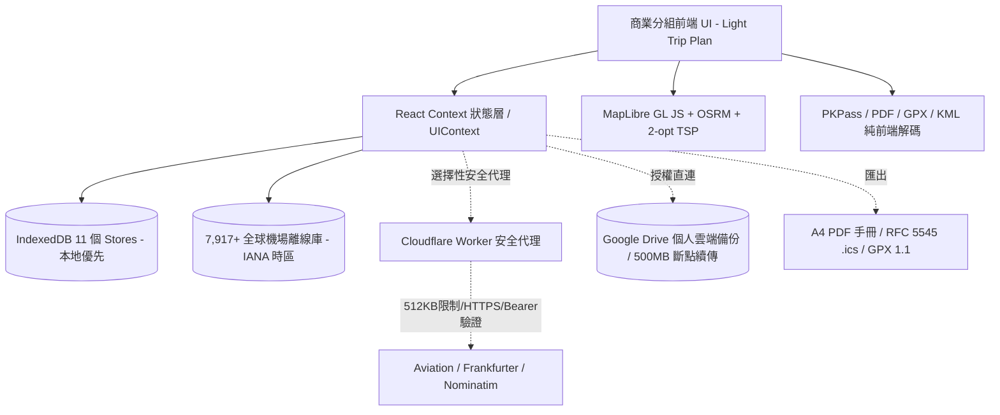

# 🧭 Light Trip Plan (智能離線旅遊規劃系統)

[](https://opensource.org/licenses/MIT)
[](https://nodejs.org/)
[](https://react.dev/)
[](https://vitejs.dev/)
[](https://vitest.dev/)
[](https://web.dev/progressive-web-apps/)
[](https://developer.mozilla.org/en-US/docs/Web/API/IndexedDB_API)

> **Light Trip Plan** 是一套專為進階旅人、商務出差、背包客與外站機票玩家打造的 **100% Client-Side 離線優先 (Offline-First)** 智慧旅遊規劃、路線演算法最佳化與多幣別清帳平台。
> 全系統無後端資料庫依賴，隱私 100% 本地留存，並具備純前端憑證解析、向量地圖路線求解、大檔斷點續傳與專業旅遊手冊輸出能力。

🔗 **[線上體驗 Demo](https://imhahac.github.io/reverse-ticket-manager/)**

---

## 🌟 四大商業核心工作台 (Core Workspaces)

```
┌────────────────────────────────────────────────────────────────────────┐
│                        Light Trip Plan Pro                             │
├───────────────────┬───────────────────┬────────────────┬───────────────┤
│  🗺️ 行程工作台    │   💰 財務中心     │   🎒 整備中心  │  🎟️ 票券憑證  │
│  - 雙欄智慧排程   │   - 多幣別記帳    │   - 智慧行李箱 │  - 機票航班   │
│  - MapLibre 向量  │   - 匯率凍結      │   - 優先級待辦 │  - 飯店住宿   │
│  - 2-opt TSP 演算 │   - 最大餘數分錢  │   - 500MB 直傳 │  - 活動票券   │
│  - 16 天氣象回溯  │   - Settle-up 清帳│   - 雲端垃圾桶 │  - PKPass/PDF │
│  - A4 手冊 / ICS  │   - CSV 報表匯出  │   - 重量滾動   │  - 查重防護   │
└───────────────────┴───────────────────┴────────────────┴───────────────┘
```

### 1. 🗺️ 智能行程規劃 (Planning Workspace)
* **MapLibre GL JS + OpenFreeMap 向量圖資**：免昂貴商業 Token、無額度耗盡風險，支援流暢向量渲染與地標聚類。
* **2-opt TSP 智慧路徑最佳化**：旅行推銷員問題求解演算法，支援自動鎖定首日啟程住宿與終日返回住宿，一鍵將當日景點重排為最短交通時間路線。
* **OSRM 實際道路路徑導航**：計算實際行車與步行轉折軌跡，並支援 Google Maps 與 Naver Maps 一鍵外部導航跳轉。
* **Open-Meteo 16 天氣候預測與歷史回溯**：自動依日程與座標獲取 16 天精準氣象，超長遠期行程自動回溯歷史同期天候作為行前穿著參考。
* **維基百科景點富化**：結合 OpenStreetMap Nominatim 搜尋，自動萃取維基百科歷史文化摘要與景點圖文。
* **外部檔案與連結解析**：純前端解析 GPX 1.1、KML、KMZ（動態解壓縮）與多行 Google Maps / Naver Maps 分享連結。
* **級聯原子日期平移 (Move Trip Dates)**：旅程改期或延期時，記憶體預算天數差並在單一 IndexedDB 跨 Store 交易原子提交，同步重新錨定日程、航班、飯店與待辦事項。
* **出版級 A4 旅遊手冊**：向量列印優化排版、支援另存高品質 PDF 與 Markdown 一鍵複製至 Notion/Obsidian。

### 2. 💰 多幣別財務與智慧清帳 (Finance Workspace)
* **Frankfurter API 匯率與凍結機制**：即時獲取歐洲央行國際匯率，記帳當下即時鎖定換算匯率（Frozen Rate），確保回國平帳不因匯率波動失真。
* **最大餘數分錢法 (Largest Remainder Method)**：多人外幣平攤精準計算至最小貨幣單位，徹底消滅無窮小數斷頭分與借貸借方漂移。
* **Settle-up 債務最小化撮合清帳方案**：雙指針貪婪最小化轉帳次數演算法，自動吸收 1 分錢浮點數微差至主要出資人，徹底杜絕死結與未清餘額。
* **UTF-8 BOM CSV 匯出**：相容繁體中文 Excel 一鍵匯出全旅程開銷明細。

### 3. 🎒 整備中心與大檔管理 (Preparation Workspace)
* **智慧行李清單**：內建氣候情境範本（海島度假、滑雪賞雪、長途歐美），具備「全員可見 / 僅限伴侶 / 私人隱私」三層能見度過濾與即時重量動態滾動。
* **行前待辦任務 (Todos)**：支援負責人指派、優先級分類（緊急 / 高 / 中 / 低）、到期日倒數警示與逾期高亮。
* **500MB 大檔直傳 Google Drive**：支援 50MB 憑證檔案與 500MB 高畫質旅遊影片直傳，採用 Google Drive Resumable API，具備 `Content-Range` 狀態探測與指數退避斷點續傳。
* **軟刪除垃圾桶 (Trash Bin)**：誤刪項目保留於垃圾桶，支援一鍵即時還原。

### 4. 🎟️ 雙軌票券憑證與管理 (Tickets Workspace)
* **16 種通用預訂類型**：涵蓋機票、飯店、火車高鐵、渡輪、租車、活動、餐飲、保險、旅行團等，標配專屬視覺識別。
* **純前端 Apple Wallet PKPass 解析器**：客戶端解壓縮讀取 `pass.json`，萃取航班時間、登機門、座位與 PNR。
* **純前端 PDF 憑證文字抽取解析**：離線抽取機票與住宿憑證關鍵資訊。
* **外站票自動拆解演算法**：以出發地機場為錨點，自動將多張單程票、Open-Jaw 機票重新重構為連續閉環趟次。
* **自然鍵 (confirmationCode) 查重防護**：防止使用者重複拖曳同一張憑證產生重複資料。

---

## 🏗️ 系統架構概念 (System Architecture)


```mermaid
graph TD
    UI[商業分組前端 UI - Light Trip Plan] --> Context[React Context 狀態層 / UIContext]
    Context --> DB[(IndexedDB 11 個 Stores - 本地優先)]
    Context --> OfflineAirport[(7,917+ 全球機場離線庫 - IANA 時區)]
    
    UI --> MapEngine[MapLibre GL JS + OSRM + 2-opt TSP]
    UI --> Ingestion[PKPass / PDF / GPX / KML 純前端解碼]
    
    Context -. 選擇性安全代理 .-> CFWorker[Cloudflare Worker 安全代理]
    CFWorker -. 512KB限制/HTTPS/Bearer驗證 .-> ExtAPI[Aviation / Frankfurter / Nominatim]
    
    Context -. 授權直連 .-> GDrive[(Google Drive 個人雲端備份 / 500MB 斷點續傳)]
    Context -. 匯出 .-> ExportEngine[A4 PDF 手冊 / RFC 5545 .ics / GPX 1.1]
```

### 資料儲存核心 (IndexedDB 11 Stores)
全系統採用 `idb` 封裝，取代瀏覽器傳統 `localStorage` 5MB 容量上限，具備極高容量與原子交易安全性：
* `trips`：旅程主設定與出發/結束日期
* `dayPlans`：每日行程與時間軸
* `placeItems`：景點點位、地理坐標與備忘錄
* `reservations`：16 種預訂模型與電子憑證
* `expenses`：多幣別開銷與凍結匯率
* `settleRecords`：平帳與清帳軌跡
* `packingItems`：行李打包清單與重量配置
* `todos`：行前待辦與優先級追蹤
* `files`：檔案附件元資料與 Google Drive 檔案對應
* `auditLogs`：系統操作日誌
* `settings`：使用者個人化設定與幣別預設值

---

## 🛠️ 開發與環境建置 (Quick Start)

### 1. 本地啟動
```bash
# 安裝依賴
npm install

# 啟動本地開發伺服器 (Vite)
npm run dev

# 執行生產打包測試
npm run build
```

### 2. 品質門禁與自動化測試 (CI Gate)
本專案堅持「**不修復不上線**」，所有提交與部署均受 GitHub Actions CI 嚴格卡關：
```bash
# 靜態代碼檢查 (需為 0 錯誤、0 警告)
npm run lint

# 單元與整合測試 (40 項測試需 100% 通過)
npm test
```

---

## 🔐 隱私、資安與零成本可觀測性

1. **零追蹤、零中心儲存**：旅客之所有航班代碼、護照號碼、住宿地址與花費明細 100% 存在旅客個人裝置 IndexedDB 中。
2. **安全代理加固 (Cloudflare Worker)**：
   * 限制最大 Request Body 512KB，杜絕記憶體耗盡攻擊。
   * 嚴格 UUID 格式正則校驗，防 SQL/NoSQL 惡意字串。
   * 強制 HTTPS 與 `encodeURIComponent` 參數消毒，消除 SSRF 與 Open Redirect 漏洞。
   * 支援 `SHARE_SECRET_TOKEN` Bearer 鑑權。
3. **零成本除錯診斷包 (Diagnostic Dump)**：
   * 當遭遇異常或瀏覽器儲存問題時，在 Error Boundary 崩潰頁或匯出中心點擊「下載除錯診斷包」，即可一鍵匯出包含瀏覽器環境、IndexedDB 11 個 Stores 記錄計數之 JSON 報告，無任何敏感個資洩漏。

---

## 📖 部署文件
詳細之 Cloudflare Worker、GitHub Pages、Google OAuth 憑證與 PWA 配置說明，請參閱：
👉 **[完整生產環境部署指南 (deployment.md)](./deployment.md)**

---

## 授權條款
本專案採用 [MIT License](LICENSE) 授權。

